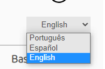
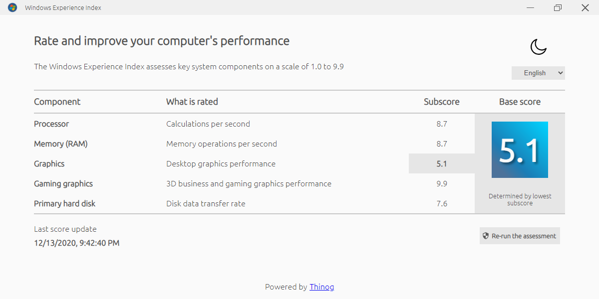
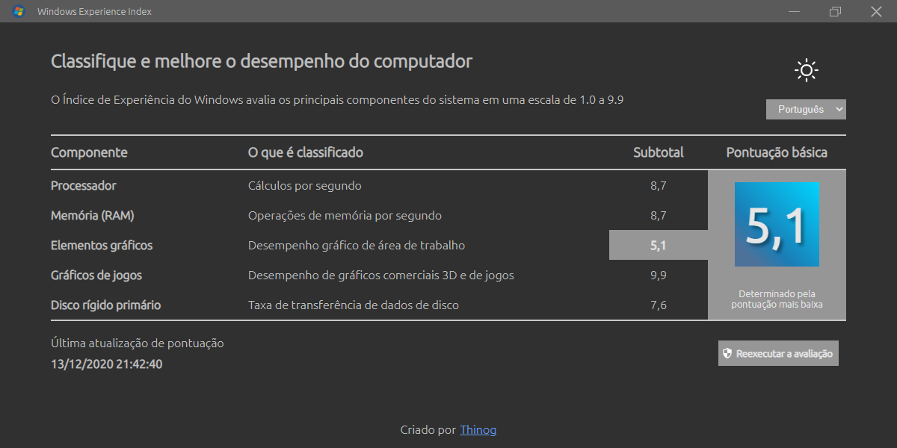

# Windows Experience Index
Aplicação desenvolvida em Node.js e Electron, feita para substituir o Windows Experience Index, que existiu até o Windows 7 e foi removido das versões posteriores do sistema operacional.

---

## Comandos locais

### Testar a aplicação
```bash
npm test
```

### Executar localmente
```bash
npm start
```

### Gerar pacote localmente
```bash
npm run dist
```

### Publicar pacote
```bash
npm run publish
```

---

## Informações adicionais
### Modo claro e escuro
A aplicação possui dois temas, claro e escuro, sendo possível trocar pelo ícone de sol ou lua no canto direito superior.


### Multi-idioma 
É possível trocar o idioma da aplicação para português, inglês e espanhol, selecionando no seletor de idioma.



### Screenshots

Modo claro em inglês




Modo escuro em português

